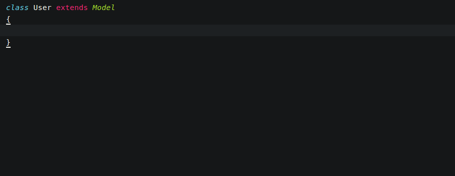

[Home](https://github.com/joshwhatk/sublime-text-configuration) - [Customizations](/customizations) - [Packages](/packages) - [Themes](/themes)

# Eloquent ORM snippets via [Jarek Tkaczyk](https://github.com/jarektkaczyk/sublime-snippets/tree/master/eloquent)

https://laravel.com/docs/eloquent

